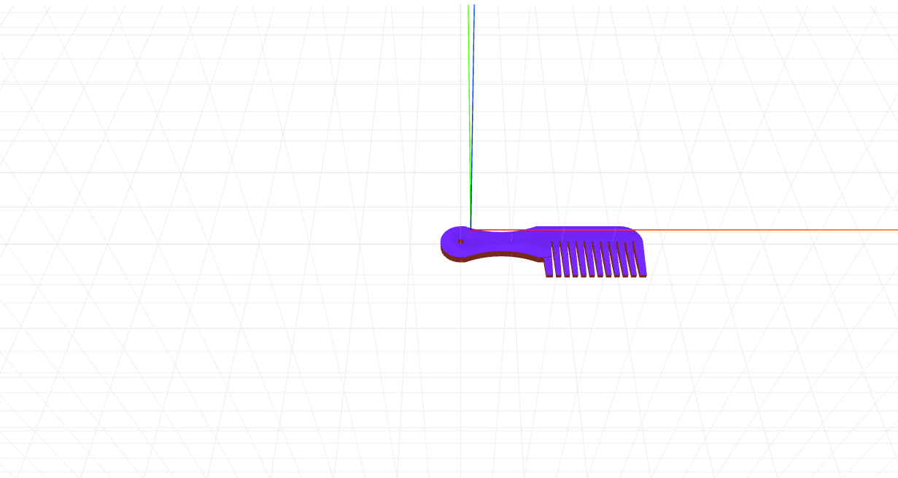

# craft-comb

# Install
```sh
$ npm install craft-comb
```
# Parameters
```sh
handleHoleRadius - determines the radius of the hole in the comb handle.
handleLength - determines the length of the comb handle.
handleThickness - determines how curvy/slim the handle is.
noOfTeeth - determines how many teeth the comb has.
```
# Example
